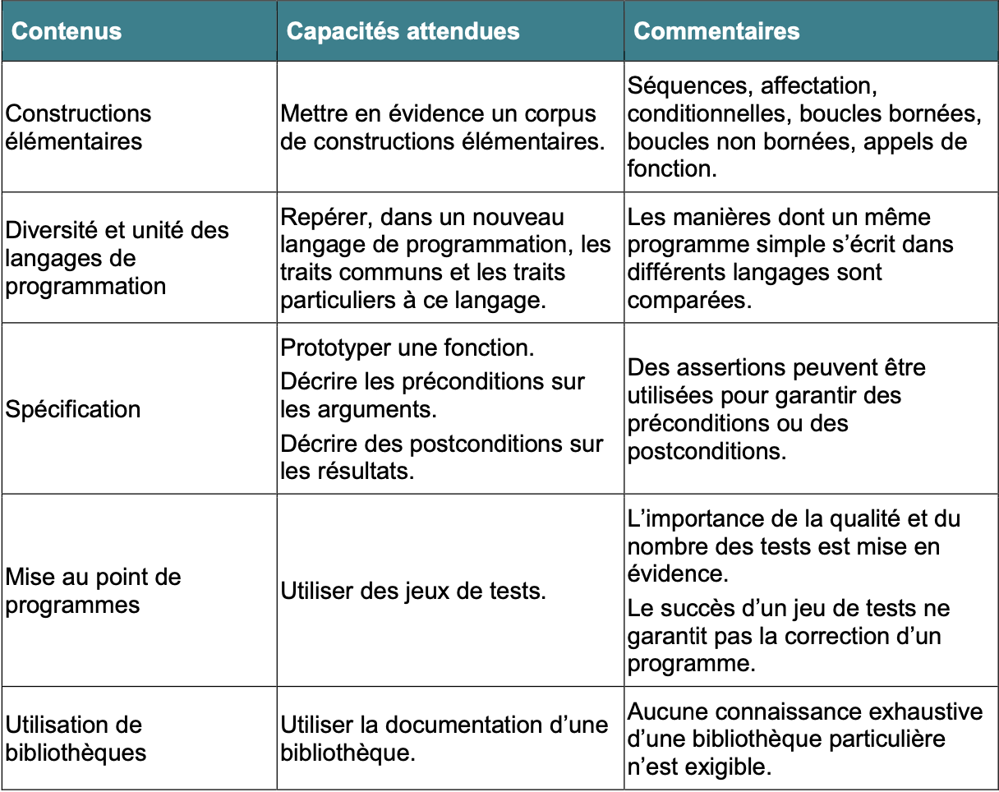
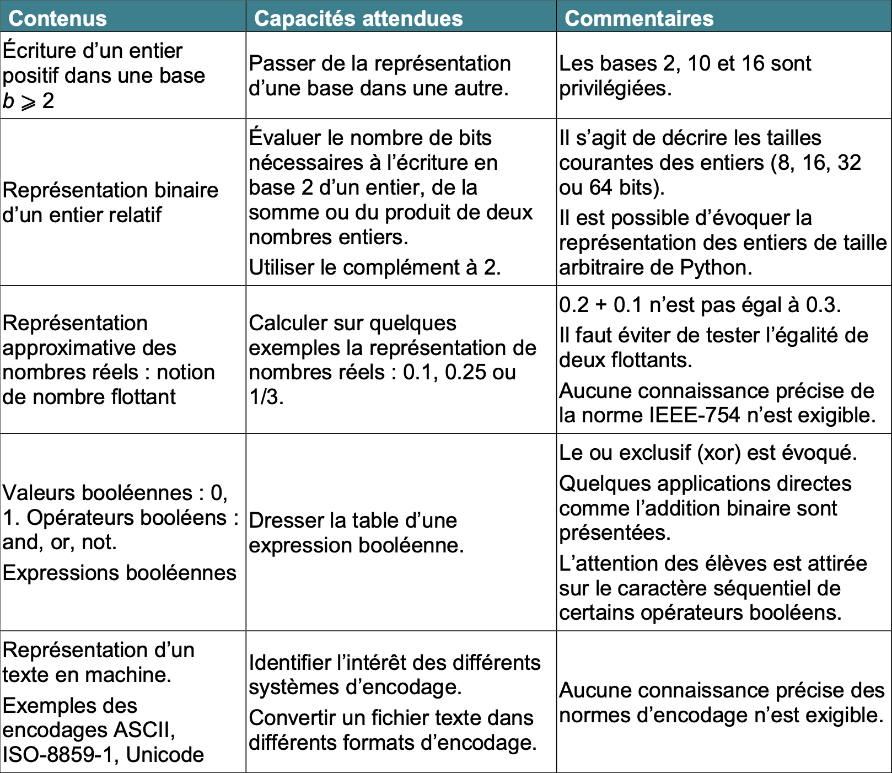
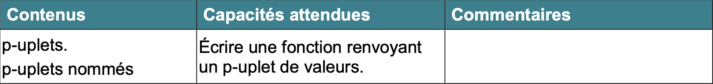
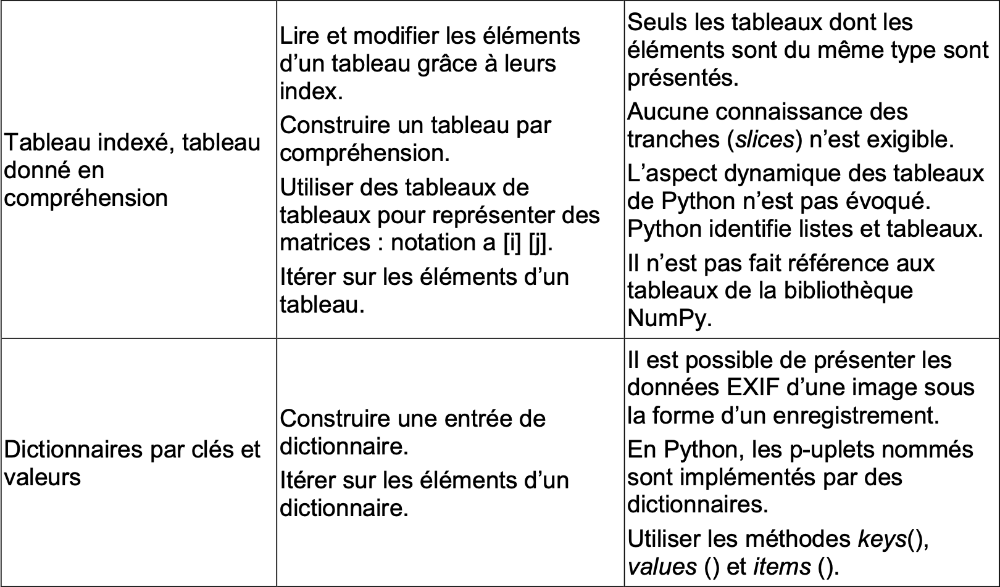
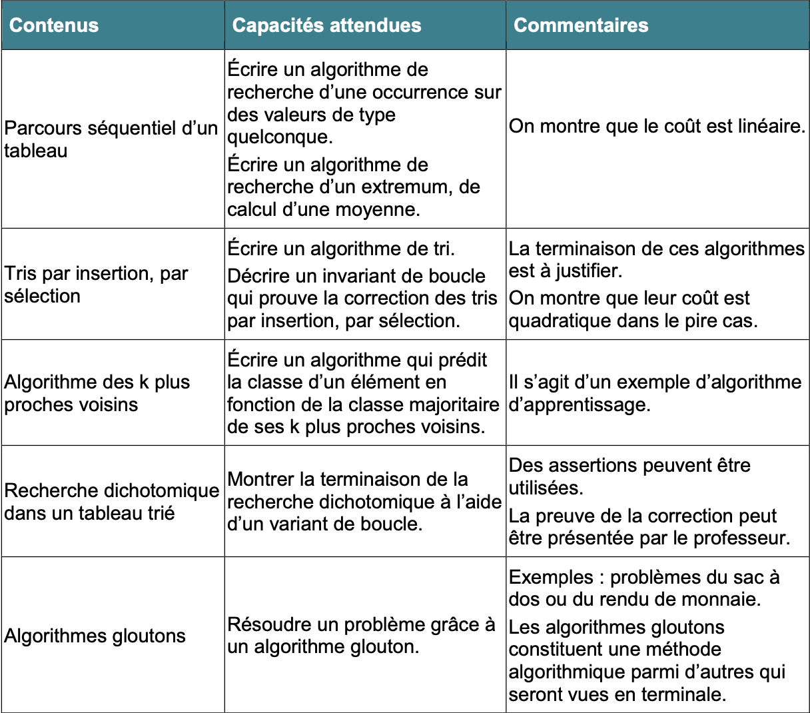
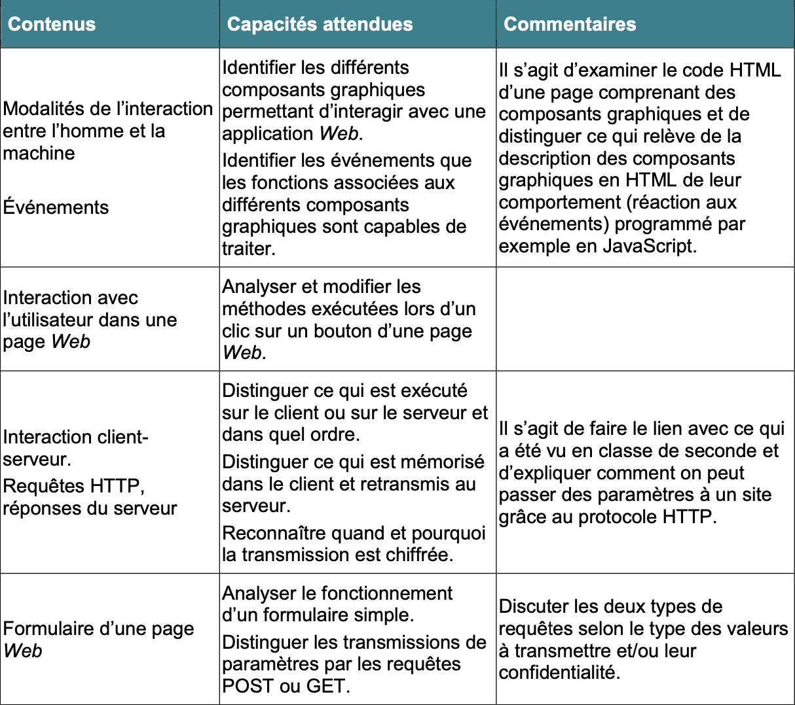
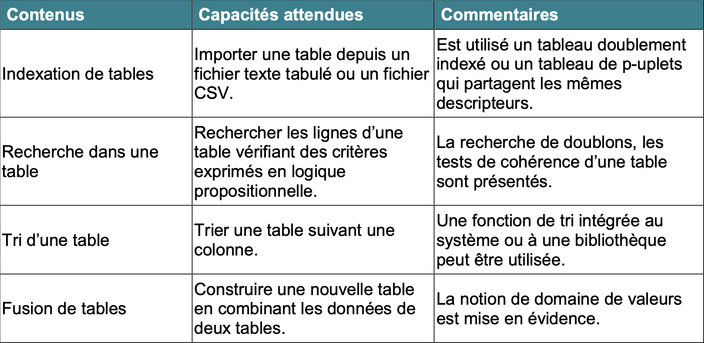
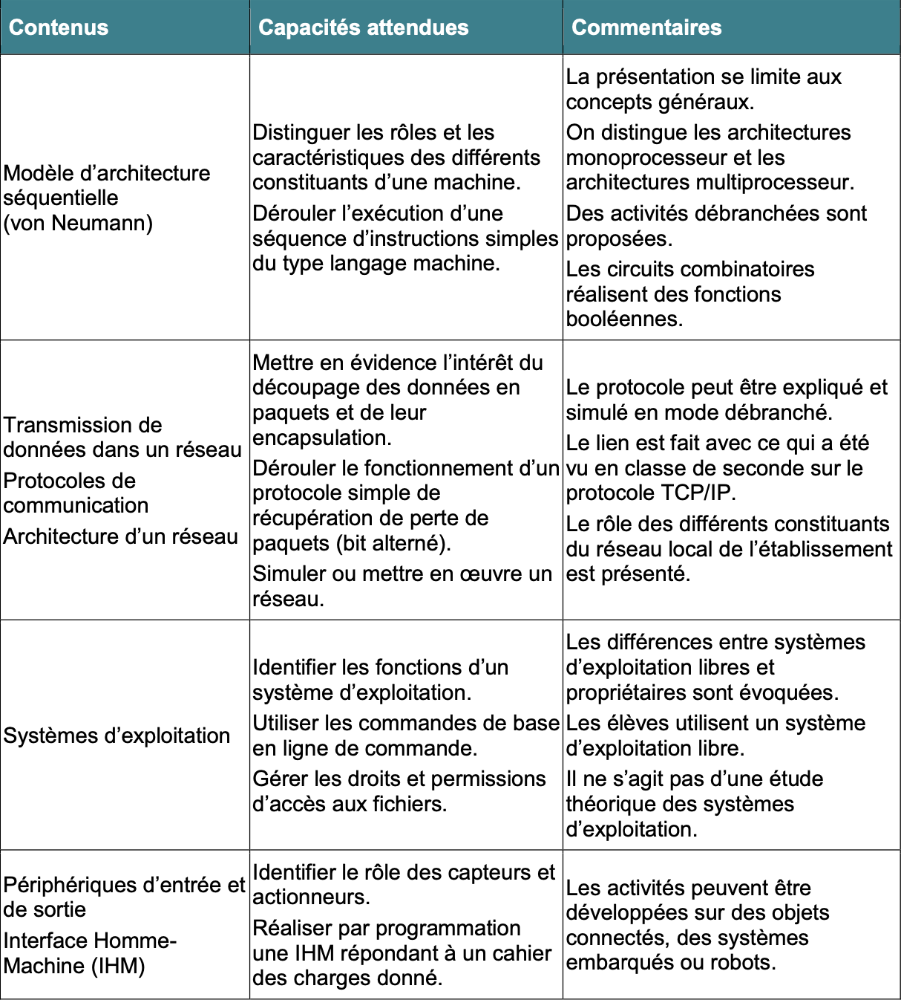

# Numérique et Sciences Informatiques
!!! done "En informatique, il n'y a pas de pré-requis. "
> **Si vous êtes motivés, si vous y passez du temps, vous serez bons, c'est tout.**
> **Les résultats que vous obtiendrez sont strictement liés à votre temps d'investissement dans cette matière.**
## Le contenu de ce site
> Ce site est destiné aux élèves qui suivent la spécialité NSI en classe de 1ère, il est composé des différents chapitres au programme de l'année, mais aussi de nombreux exercices et de guides
### **==Les bases de la programmation==**
{ width=80% }
### **==Les types de base==**
{ width=80% }
### **==Les types construits==**
{ width=80% }
{ width=80% }
### **==Les algorithmes==**
{ width=80% }
### **==la programmation du Web==**
{ width=80% }
### **==Le traitement des données==**
{ width=80% }
### **==L'architecture des machines et les sytèmes d'exploitation==**
{ width=80% }
